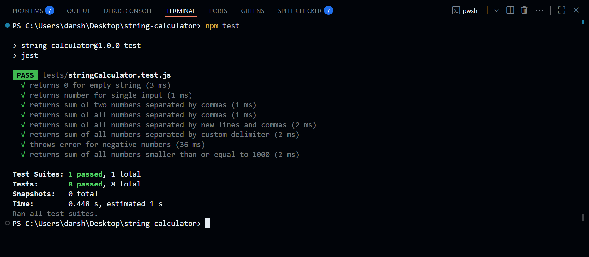
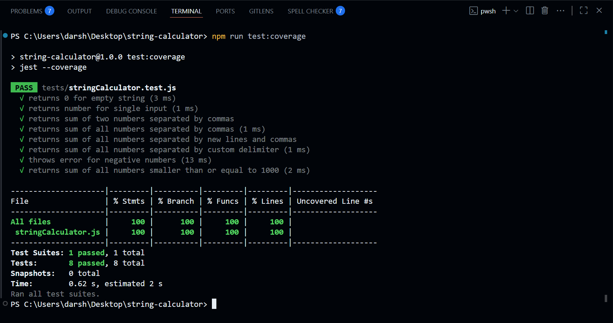

# 📐 String Calculator TDD Kata

## 📌 Problem Statement

This project is an implementation of the **String Calculator Kata** using **Test-Driven Development (TDD)** practices.

The goal is to build a string-based calculator with the following requirements:

1. An empty string returns `0`.
2. A single number returns its value.
   - Input: `"1"` → Output: `1`
3. Two numbers, comma-separated, returns the sum.
   - Input: `"1,2"` → Output: `3`
4. Multiple numbers are supported.
   - Input: `"1,2,3,4,5,6"` → Output: `21`
5. New lines `\n` can also be used as delimiters.
   - Input: `"1\n2,3\n4,5\n6"` → Output: `21`
6. Custom delimiters can be defined using the format:  
   `"//[delimiter]\n[numbers]"`
   - Input: `"//;\n1;2;3;4;5;6"` → Output: `21`
7. Negative numbers throw an exception listing all negatives:
   - Input: `"1,-2,3,-4,5,-6"` → Error: `"negative numbers not allowed: -2, -4, -6"`
8. Numbers bigger than `1000` should be ignored.
   - Input: `"1001,2"` → Output: `1002`
   - Input: `"2,1001"` → Output: `2`

---

## 🛠️ Tech Stack

- **Node.js**
- **Jest** (unit testing)
- **JavaScript (ES6+)**

---

## 🚀 Getting Started

### 1️⃣ Clone the Repository

```bash
git clone https://github.com/darshanpawar101/string-calculator.git
cd string-calculator-tdd
```

### 2️⃣ Install Dependencies

```bash
npm install
```

### 3️⃣ Run Tests

```bash
npm test
```

## ✅ Example Usage

```javascript
const stringCalculator = require("../src/stringCalculator");
const calc = new stringCalculator();

// Basic cases
console.log(calc.add("")); // 0
console.log(calc.add("1")); // 1
console.log(calc.add("1,2")); // 3

// Newline as delimiter
console.log(calc.add("1\n2,3\n4,5\n6")); // 21

// Custom delimiters
console.log(calc.add("//;\n1;2;3;4;5;6")); // 21

// negative numbers
console.log(calc.add("1,-2,3,-4,5,-6")); // negative numbers not allowed: -2, -4, -6

// Ignore numbers > 1000
console.log(calc.add("2,1001")); // 2
```

## 📂 Project Structure

```bash
string-calculator/ # Root folder
├── src/
│ └── stringCalculator.js # Core String Calculator implementation
│
├── tests/
│ └── stringCalculator.test.js # Jest unit tests
│
├── screenshots/
│ └── tests-passing.png
│ └── coverage-report.png
│
├── .gitignore
├── package.json
├── package-lock.json
└── README.md # Project documentation
```

### All Tests Passing ✅



---

### Code Coverage Report 📊



---
